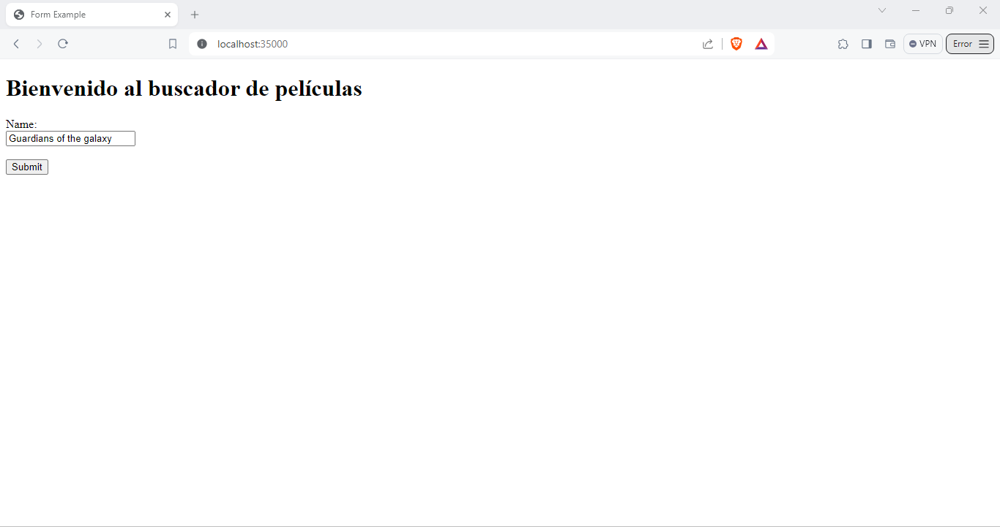
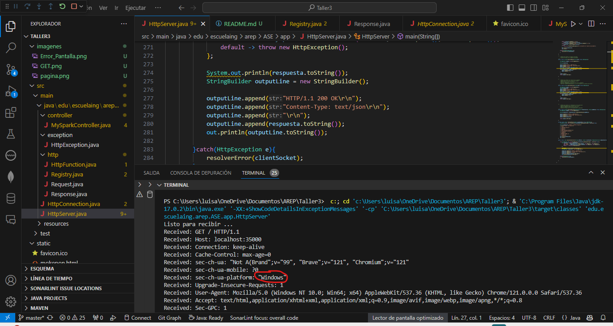
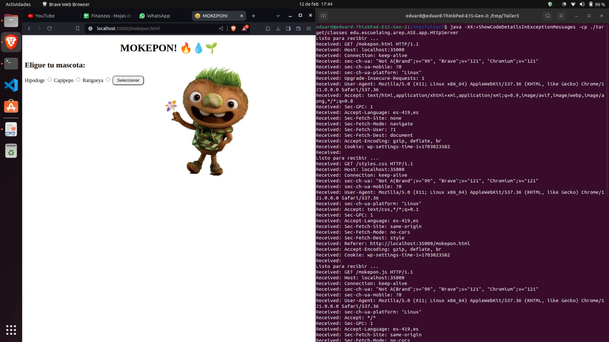
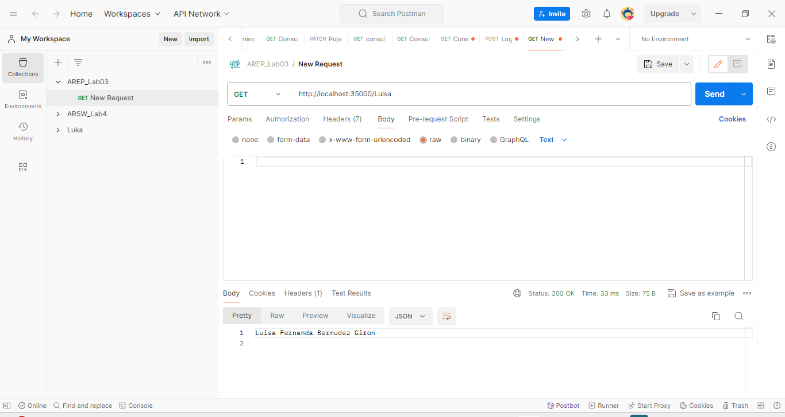
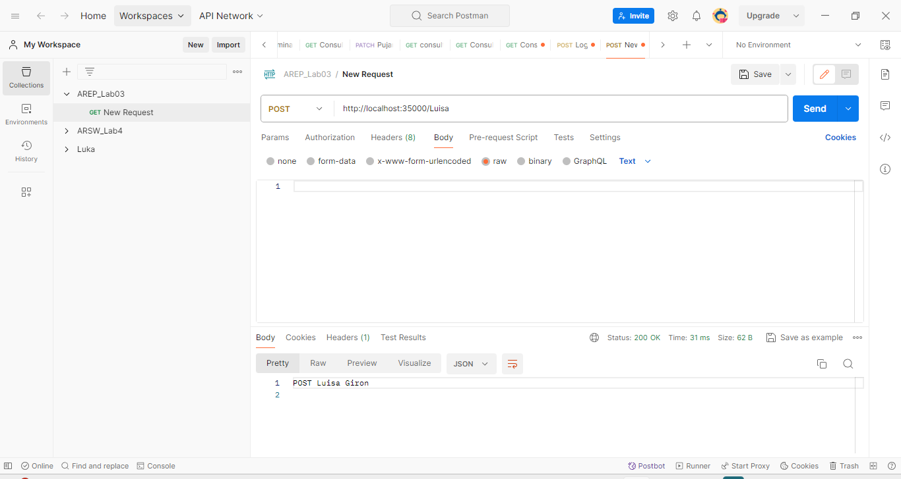

# TALLER 3: MICROFRAMEWORKS WEB

En este aplicativo se explorar la arquitectura del microframework WEB denominado [sparkweb](https://sparkjava.com/). Este micro framework permite construir aplicaciones web de manera simple usando funciones lambda.

Para este ejercicio se construyó un servidor web para soportar una funcionalidad similar a la de Spark. La aplicación permite el registro de servicios GET y POST usando funciones lambda. De igual manera se implementó funciones que permiten configurar el directorio de los archivos estáticos, y otra que permita cambiar el tipo de la respuesta a "application/json". 

Algunas funciones del servidor son:
1.	Permite configurar servicios web de tipo GET y POST usando funciones lambda.
2.	Entrega archivos estáticos como páginas HTML, CSS, JS e imágenes.
3.	Permite configurar el directorio de donde se leerán los archivos estáticos.
4.	Permite leer parámetros del query desde los programas.

### Prerrequisitos

Los prerrequisitos tecnológicos que necesita este taller son:

* [Maven](https://maven.apache.org/): Maven es un herramienta que proporciona una estructura estándar, gestión de dependencias y automatización de tareas en los proyectos software desarrollados en Java.

* [GitHub](https://platzi.com/blog/que-es-github-como-funciona/): Es una plataforma de desarrollo colaborativo basado en Git que utiliza un sistema de versiones distribuida para el seguimiento del código fuente durante el desarrollo.

* [Postman](https://www.postman.com/): Es una herramienta de colaboración para el desarrollo de APIs. Se utiliza principalmente para realizar pruebas de API, depurar y desarrollar API de forma más eficiente.

### Instalación

1.  Clone el repositorio:
```
git clone https://github.com/AREP-2024/Taller3.git
```

2. Acceda al repositorio que acaba de clonar:
```
cd Taller3
```
3. Se hace la construcción del proyecto:
```
mvn package
```
### Corriendo 

Ahora de debe poner a ejecutar el servidor:

#### Windows
```
 mvn exec:java -"Dexec.mainClass"="edu.escuelaing.arep.ASE.app.HttpServer"
```
##### *Ejemplo de archivos planos*


En la siguiente imagen de la terminal se puede ver que está ejecutando en un sistema Windows.



#### Linux/MacOs

```
 mvn exec:java -Dexec.mainClass="edu.escuelaing.arep.ASE.app.HttpServer"
```


#### *Ejemplo GET*

Para ver que el método GET en funcionamiento, use Postman. La URL que se encuentra registrada es:

```
http://localhost:35000/Luisa
```



#### *Ejemplo POST*
Para ver que el método POST en funcionamiento, use Postman. La URL que se encuentra registrada es:

```
http://localhost:35000/Luisa
```


**Nota:** Para ver los demás archivos planos use las siguientes URLs:

* La siguiente URL lo llevara a consultar la API REST construida en el Taller1
```
http://localhost:35000/
```
* Un adicional que tiene este aplicativo web es que si usted desea observar únicamente los JSON que genera la API REST lo podrá hacer de la siguiente manera
```
http://localhost:35000/Peliculas/nombrePelicula
```
No olvide remplazar donde dice **nombrePelicula** por el nombre de la película de desea buscar ejemplo:
```
http://localhost:35000/Peliculas/Barbie
```

* Si usted desea ver la pagina web que se construyo con: HTML, JavaScript, CSS y que además tiene una imagen use la siguiente URL
```
http://localhost:35000/mokepon.html
```

* Para ver documento JavaScript use la siguiente URL:
```
http://localhost:35000/mokepon.js
```

* Para ver el documento CSS use la siguiente URL:
```
http://localhost:35000/styles.css
```

* Para poder observar la imagen use la siguiente URL:
```
http://localhost:35000/Tierra.png
```

### Construido con

* [Maven](https://maven.apache.org/): Maven es un herramienta que proporciona una estructura estándar, gestión de dependencias y automatización de tareas en los proyectos software desarrollados en Java.

* [GitHub](https://platzi.com/blog/que-es-github-como-funciona/): Es una plataforma de desarrollo colaborativo basado en Git que utiliza un sistema de versiones distribuida para el seguimiento del código fuente durante el desarrollo. 

* [Visual Studio Code](https://code.visualstudio.com/):Es un entorno de desarrollo integrado (IDE) ligero y de código abierto desarrollado por Microsoft

* [Java 17](https://www.java.com/es/download/help/whatis_java.html): Es un lenguaje de programación de propósito general, orientado a objetos y diseñado para ser independiente de la plataforma. 

* [HTML](https://developer.mozilla.org/es/docs/Web/HTML): Es el lenguaje de marcado que se utiliza para crear páginas web. Se define como un conjunto de etiquetas que se utilizan para estructurar y dar significado al contenido de una página web.

* [JavaScript](https://aws.amazon.com/es/what-is/javascript/): Es un lenguaje de programación de alto nivel, interpretado y orientado a objetos. Se utiliza principalmente en el desarrollo web para crear páginas web interactivas y dinámicas

* [CSS](https://lenguajecss.com/css/introduccion/que-es-css/) : Es un lenguaje de diseño utilizado para definir como se deben mostrar los elementos de una página web.

### Autor
[Luisa Fernanda Bermudez Giron](https://www.linkedin.com/in/luisa-fernanda-bermudez-giron-b84001262/) - [Luisa Fernanda Bermudez Giron](https://github.com/LuisaGiron)

### Licencias 

**©** Luisa Fernanda Bermudez Giron, Estudiante de Ingeniería de Sistemas de la Escuela Colombiana de Ingeniería Julio Garavito.